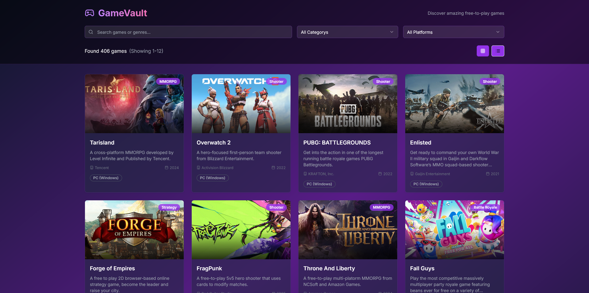
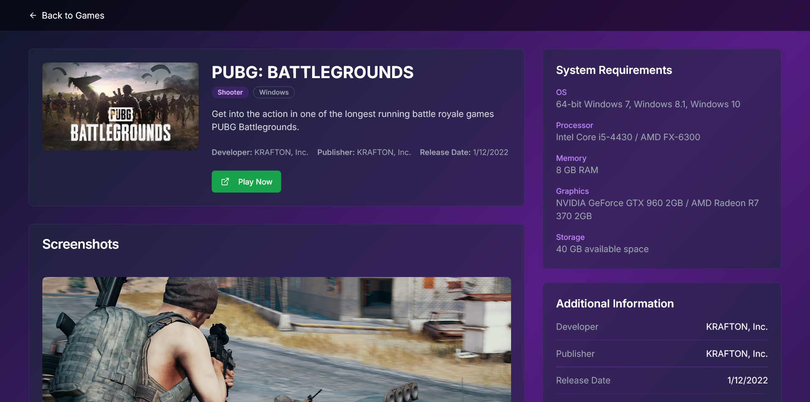

# Free to Play Haven

Discover and explore the best free-to-play games, beautifully organized and easy to browse.

## Features

- Browse a curated list of free-to-play games
- Filter by platform and genre
- Search games by title or genre
- Responsive grid and list views
- Game details with screenshots and system requirements
- Fast navigation with React Router
- Toast notifications for errors and actions

## Images

| Home Page                       | Game Details Page                      | Game List (Grid) Page                   |
| ------------------------------- | -------------------------------------- | --------------------------------------- |
|  |  |  |

## Tech Stack

- React + TypeScript
- Vite
- Tailwind CSS
- shadcn/ui
- React Query

## Getting Started

1. **Install dependencies:**
   ```sh
   npm install
   ```
2. **Set up environment variables:**
   - Copy `.env.example` to `.env.local` and add your RapidAPI key for the Free-to-Play Games Database.
3. **Run the development server:**
   ```sh
   npm run dev
   ```
4. **Open in your browser:**
   - Visit [http://localhost:5173](http://localhost:5173)

---

Enjoy discovering new games!
